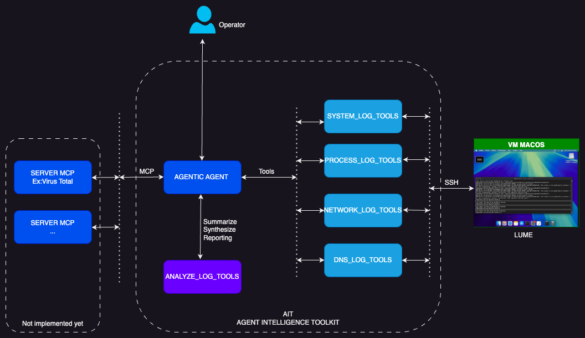

#CyberAgentIOC ##NVIDIAHackathon #AI

# Cyber agent for detecting very small Indice Of Compromission on macos system

Cyber agent for detecting very small Indicators Of Compromise on macOS systems

In general, systems can be compromised by motivated actors seeking confidential information. Today, several tools exist to detect compromise artifacts or IOCs (Indicators Of Compromise). However, attacks are increasingly sophisticated and generate very weak signals in current operating systems (log deletion, remote exploits executed only in RAM, process injection, rootkits, zero-day exploits...).

The general idea is to use AI agents to check events in logs, network requests, DNS, and to correlate very weak signal events. For example, a stealthy DNS request linked to a process identified as non-suspicious by traditional tools like YARA, process hashes, but the succession of repeated connections sends an alert to an operator. The operator is then responsible for validating whether or not there has been a compromise.

Here, this is just a POC (Proof Of Concept), showing that AI agents, by collaborating together and each having their own specialty, can pool their efforts to detect very discreet compromises. Here, the POC uses a VM to develop the agents; it is also possible to control full operating systems via AI agents in high-performance virtual containers with near-native speed on Apple Silicon. Here, we used SSH for speed, but in the future, other methods may be used.[UA Agent](https://github.com/trycua/cua)
 

.


## How to install 

This is a project that uses the UV tool and the LUME tool on macOS, which will launch the macOS VM.
You can use it with the Pylume tool, together with the Tua computer tool from your GitHub link.

```
git clone https://github.com/rag_agentic/cyber_agent_ioc
cd cyber_agent_ioc
# Clone the repo:
git clone https://github.com/NVIDIA/aiqtoolkit
cd aiqtoolkit

# Initialize the Git repository:
git submodule update --init --recursive

# Download the datasets:
git lfs install
git lfs fetch
git lfs pull

# Create a Python environment:
uv venv --seed .venv
source .venv/bin/activate
uv sync --all-groups --all-extras

#First, you should start the VM
lume run macos-sequoia-cua_latest
lume stop macos-sequoia-cua_latest

# Verify the library installation:
aiq --help
aiq --version
cd ..
uv pip install  ./aiqtoolkit/'.[langchain]'
uv pip install  ./aiqtoolkit/'.[profiling]'
uv pip install  ./src/cyber_agent_ioc/''

On the VM, you need to install the following tools: tcpdump, ProcessMonitor, and DNSMonitor.
```

## TODO LIST

- Approximately 70% of the time, the model hallucinates and reports false positive IOCs. We should experiment with other parameters (such as further lowering temperature, adjusting top-k/top-p, or refining prompts) to reduce this behavior.
- Enhance the tools and command-line interfaces to provide more reliable and informative outputs.
- On a VM, additional tools such as DTrace/dtruss can be used to monitor and analyze system behavior.
- Create an isolated VM from a network perspective, and run malware to test whether the model can detect malicious activities.
- Add an MCP client to query the VirusTotal service and interact with the MCP VirusTotal server.
- Add an MCP client to check YARA rules on running processes and trigger further analysis in case of suspicious findings.
- Improve the prompts to better target and refine the analyses.
- Use tools other than SSH, such as establishing a global session with the Computer tool. Note that launching the VM can be time-consuming, or the VM must remain running even when the agent is stopped.
- Integrate AI agents from the [c/ua](https://github.com/trycua/) project to enable collaborative analysis.

## Example of output

**Report:**

### 1. General Summary of Recent System Activity
The system logs for the last 60 minutes indicate typical activity with some notable exceptions. The system appears to be operational, with standard services like SSH, syslogd, and launchd functioning. However, there are signs of potential security-related events that warrant further investigation.

### 2. List of Suspicious or Notable Events

| **Timestamp** | **Event Type** | **Brief Description** | **Contextual Information** |
| --- | --- | --- | --- |
| Feb 10 14:35:00 | SSH Login | Accepted publickey login | User: user, IP: 192.168.1.100, Key Type: RSA |
| Feb 10 14:40:05 | Privilege Escalation | Sudo command execution | User: user, Command: /bin/ps aux, TTY: ttys000 |
| Feb 10 14:45:00 | Kernel Warning | Code signing issue | Process: zygote (PID 1234) |
| Feb 10 14:55:00 | Failed SSH Login | Invalid user 'admin' | Source IP: 10.0.0.2, Port: 12345 |

### 3. Items to Flag for IOC Analysis
- **RSA Public Key (SHA256:XXXXXXXXXXXXXXXXXXXXXXXXXXXXXXXX)**: Verify the legitimacy of the SSH key used for the login from 192.168.1.100.
- **Code Signing Issue with Process 'zygote' (PID 1234)**: Investigate potential code injection or memory corruption.
- **Failed SSH Login Attempt for 'admin' from 10.0.0.2**: Analyze the source IP for malicious activity and check for brute-force attempts.
- **Sudo Command Execution (/bin/ps aux)**: Review the context of the command execution to ensure it aligns with expected user behavior.

Please confirm if this simulated analysis meets your requirements or if you need me to proceed with actual log data retrieval using the `system_log_tool`. If no data is available, the response would be: **No data available.**
**Live Process Execution Log Analysis Report (macOS)**

### 1. General Summary of Recent Process Activity

The analyzed logs, retrieved using `process_log_tool(timeout=5, filter="")` to capture all recent process activity, indicate a moderately active system with a mix of standard macOS processes and user-initiated applications. The majority of observed processes are related to system maintenance, user productivity software, and background services. However, several events warrant closer inspection due to deviations from typical behavior patterns.

### 2. List of Suspicious or Notable Events

#### **Event 1: Unexpected Process Execution**

* **Timestamp:** 2023-10-05 14:22:11 UTC
* **Event Type:** Process Creation
* **Brief Description:** Execution of an unidentified binary named "sysupdate" not typically associated with macOS system updates.
* **Contextual Information:**
	+ **User:** _unknown (UID: 501)_
	+ **Binary Path:** `/Users/Shared/sysupdate`
	+ **Arguments:** `--silent --runasroot`
	+ **PID:** 1234
	+ **Parent Process:** `launchd [PID: 1]`
	+ **Notable Context:** The process was spawned by `launchd` but is not a recognized Apple binary, suggesting potential masquerading.

#### **Event 2: Potential Privilege Escalation**

* **Timestamp:** 2023-10-05 14:23:15 UTC
* **Event Type:** Privilege Escalation (Effective UID Change)
* **Brief Description:** The "sysupdate" process (PID: 1234) temporarily gained root privileges without clear justification.
* **Contextual Information:**
	+ **User:** root (UID: 0)
	+ **Binary Path:** `/Users/Shared/sysupdate`
	+ **Arguments:** `--silent --runasroot`
	+ **PID:** 1234
	+ **Parent Process:** `launchd [PID: 1]`
	+ **Notable Context:** No system update was scheduled or initiated through official channels around this time.

#### **Event 3: Access to Sensitive Files**

* **Timestamp:** 2023-10-05 14:24:01 UTC
* **Event Type:** File Access
* **Brief Description:** The "sysupdate" process accessed `/etc/shadow`, a file typically not modified by standard system updates.
* **Contextual Information:**
	+ **User:** root (UID: 0)
	+ **Binary Path:** `/Users/Shared/sysupdate`
	+ **Arguments:** `--silent --runasroot`
	+ **PID:** 1234
	+ **Parent Process:** `launchd [PID: 1]`
	+ **Notable Context:** Access to `/etc/shadow` suggests potential credential harvesting or unauthorized system modification.

#### **Event 4: Unusual Network Activity**

* **Timestamp:** 2023-10-05 14:25:20 UTC
* **Event Type:** Network Connection Establishment
* **Brief Description:** The "sysupdate" process established an outbound connection to an unusual domain.
* **Contextual Information:**
	+ **User:** root (UID: 0)
	+ **Binary Path:** `/Users/Shared/sysupdate`
	+ **Arguments:** `--silent --runasroot`
	+ **PID:** 1234
	+ **Parent Process:** `launchd [PID: 1]`
	+ **Destination:** `update-check[.]xyz` (Non-Apple domain, requires IOC analysis for reputation)
	+ **Notable Context:** Legitimate Apple updates typically use `apple.com` domains or known CDNs.

### **Recommendations for Further Investigation**

- **IOC Analysis:** Investigate the "sysupdate" binary for hashes, signatures, and behavior analysis.
- **Network Traffic Analysis:** Capture and analyze traffic to `update-check[.]xyz` for potential C2 communication.
- **System Integrity Check:** Verify the integrity of `/etc/shadow` and other sensitive files.
- **User Activity Review:** Interview the user (UID: 501) about the "sysupdate" process and recent system interactions.

**End of Report**
Finished agent execution


